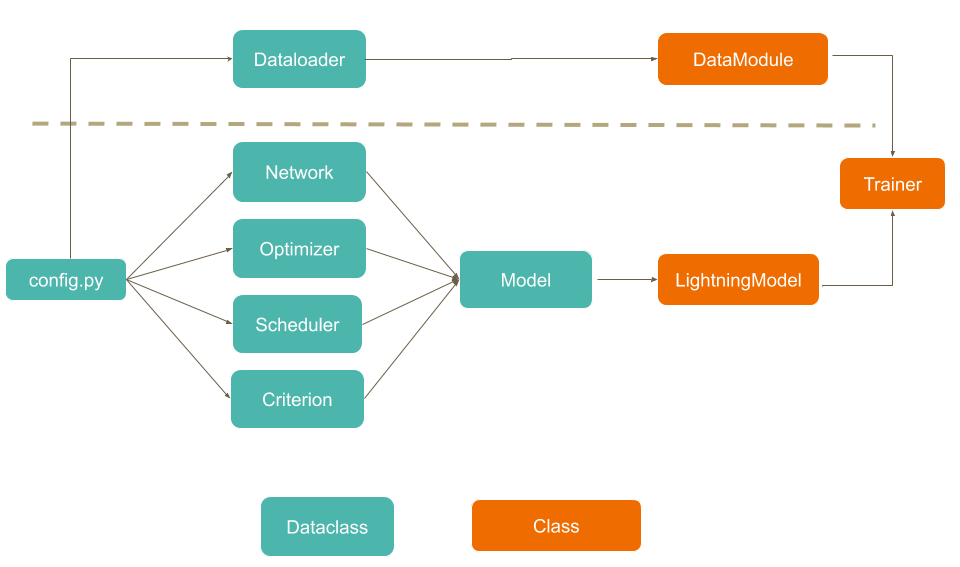

<!--
+----------------------------------------------------------------------------------------------------+
|                                                                                                    |
|                                            BANNER & SHIELD                                         |
|                                                                                                    |
+----------------------------------------------------------------------------------------------------+
 -->


<p align="center">
    <!-- Last Master Commit-->
    
        <!-- Last Commit-->
    
    <!-- Commit Status -->
    
</p>

<!--
+----------------------------------------------------------------------------------------------------+
|                                                                                                    |
|                                               MAIN TITLE                                           |
|                                                                                                    |
+----------------------------------------------------------------------------------------------------+
 -->

# DATA CHALLENGE JFR 2020

Implémentation Pytorch du Data Challenge 2020 pour les Journées Françaises de la Radiologie:

Détermination automatique du score calcique sur Scanner 3D


Dataloader basé sur [fastaiv2](https://github.com/fastai/fastai)

Modèle et entrainement basé sur [Pytorch Lightning](https://github.com/PyTorchLightning/pytorch-lightning).


<!--
+----------------------------------------------------------------------------------------------------+
|                                                                                                    |
|                                                DEVNOTE                                             |
|                                                                                                    |
+----------------------------------------------------------------------------------------------------+
 -->

# NOTE POUR LES CONTRIBUTEURS

Lorsque vous participez à ce projet, penser à: 

1. Développer en dehors de la branche master
2. Faire des commits petits à réguliers
3. Mettre à jour les badges, notamment la branche du dernier commit
4. Dès qu'on développe une feature ou un bugfix: mettre à jour le tableau correspond
5. Dès qu'une feature est prête, merge sur master
6. Dès qu'on merge sur master, mettre à jour le tableau correspondant


<!--
+----------------------------------------------------------------------------------------------------+
|                                                                                                    |
|                                          TABLE OF CONTENTS                                         |
|                                                                                                    |
+----------------------------------------------------------------------------------------------------+
 -->

# SOMMAIRE

- [A Faire](#to-do-for-next-release)
     - [New Features](#new-features)
     - [Bugfixes](#bugfixes)
- [Last Commit Changes Log](#last-commit-changes-log)
- [Installation](#installation)
- [Usage](#usage)


<!--
+----------------------------------------------------------------------------------------------------+
|                                                                                                    |
|                                                  TO DO                                             |
|                                                                                                    |
+----------------------------------------------------------------------------------------------------+
 -->


# A faire
[(Back to top)](#table-of-contents)

## New features:

| Features                                                 |      Status      |     Owner    |
|----------------------------------------------------------|:----------------:|:------------:|
| Dataloader                                               |  TO DO           |              |
| Dataloader: load dcm par dossier (ie par patient)        |  TO DO           |              |
| Dataloader: rescale correct                              |  TO DO           |              |
| Dataloader: normalisation basée sur l'histogramme        |  TO DO           |              |
| Dataloader: suppression des coupes inutiles              |  TO DO           |              |
| Dataloader: crop centré sur le coeur                     |  TO DO           |              |


## Bugfixes:

| Bugfixes                                                 |      Status      |     Owner    |
|----------------------------------------------------------|:----------------:|:------------:|
| Rien pour l'instant                                      |                  |              |

<!--
+----------------------------------------------------------------------------------------------------+
|                                                                                                    |
|                                              CHANGES LOG                                           |
|                                                                                                    |
+----------------------------------------------------------------------------------------------------+
 -->


# Last Commit Changes Log

- initialisation du github


<!--
+----------------------------------------------------------------------------------------------------+
|                                                                                                    |
|                                              INSTALLATION                                          |
|                                                                                                    |
+----------------------------------------------------------------------------------------------------+
 -->

# Installation
[(Back to top)](#table-of-contents)

Clonez le repo:

```git clone https://github.com/the-dharma-bum/jfr2020```

Installer toutes les dépendances:

``` pip install requirements.txt ```


<!--
+----------------------------------------------------------------------------------------------------+
|                                                                                                    |
|                                                 USAGE                                              |
|                                                                                                    |
+----------------------------------------------------------------------------------------------------+
 -->

# Usage
[(Back to top)](#table-of-contents)



Tous les hyperparamètres sont configurables dans le fichier config.py.
Autrement, les hyperparamètres sont configurables en instanciant les dataclass de configuration (se référer à config.py pour les instancier correctement).
Une fois les dataclass de configuration instanciées, une dataclass config peut être instanciée avec comme attribut les dataclass de configuration.
Ensuite, un objet model (voir model.py) peut être instancié avec cette dataclass config.
Enfin, ce model est donné à un objet trainer. 

En résumé, l'initilisation se fait en 3 étapes: 
- 1. Instanciation d'une configuration
- 2. Instanciation d'un model à l'aide de l'objet de configuration
- 3. Instanciation d'un trainer avec un model.


Cette architecture a plusieurs avantages, notamment:

1. Tous les hyperparamètres sont accessibles depuis un même fichier. 
2. Tous les hyperparamètres sont découplés du code qui les utilise.
3. La partie modèle est découplée de la partie data (!).
4. Un datamodule est partageable et réutilisable.

Une fois tout paramétré, il suffit de lancer:

```python main.py ```

Cette commande est compatible avec un grand nombre d'arguments. Tapez

```python main.py -h ```

pour les voir tous, ou référez vous à la [documentation de Pytorch Lightning](https://pytorch-lightning.readthedocs.io/en/latest/).

Quelques paramètres utiles:

- ```--gpus n``` : lancer l'entraînement sur n gpus
- ```--distributed_backend ddp``` : utiliser DistributedDataParallel comme backend pour entraîner sur plusieurs gpus.
- ```--fast_dev_run True``` : lance une boucle d'entraînement complète sur un batch (train, eval, test). A utiliser pour débuguer.

Si vous voulez débuguez mais que fast_dev_run ne vous convient pas (par exemple si vous voulez voir ce qu'il se passe entre deux époques), vous pouvez utiliser:

- ```--limit_train_batches i --limit_val_batches j --max_epochs k```

i,j,k étant bien sûr trois entiers de votre choix.


